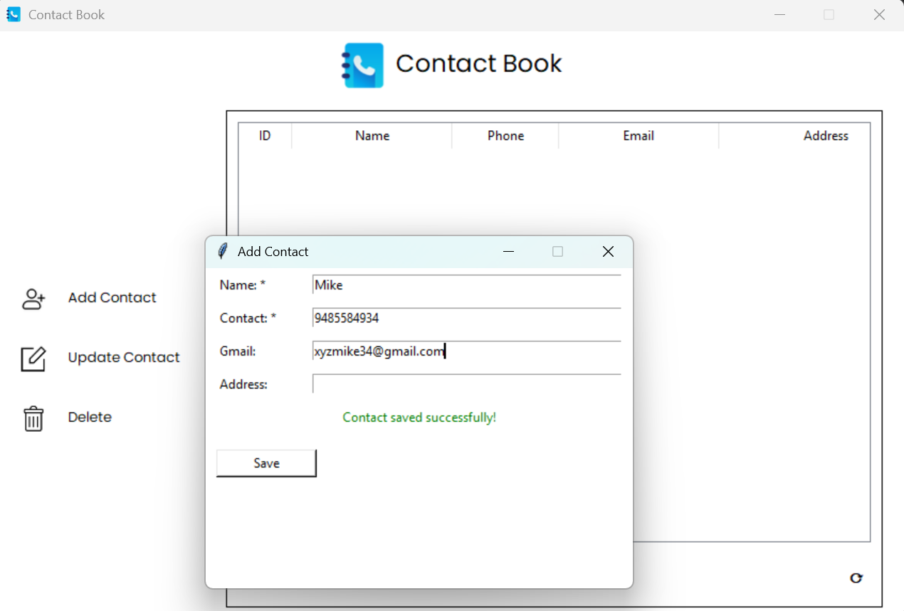
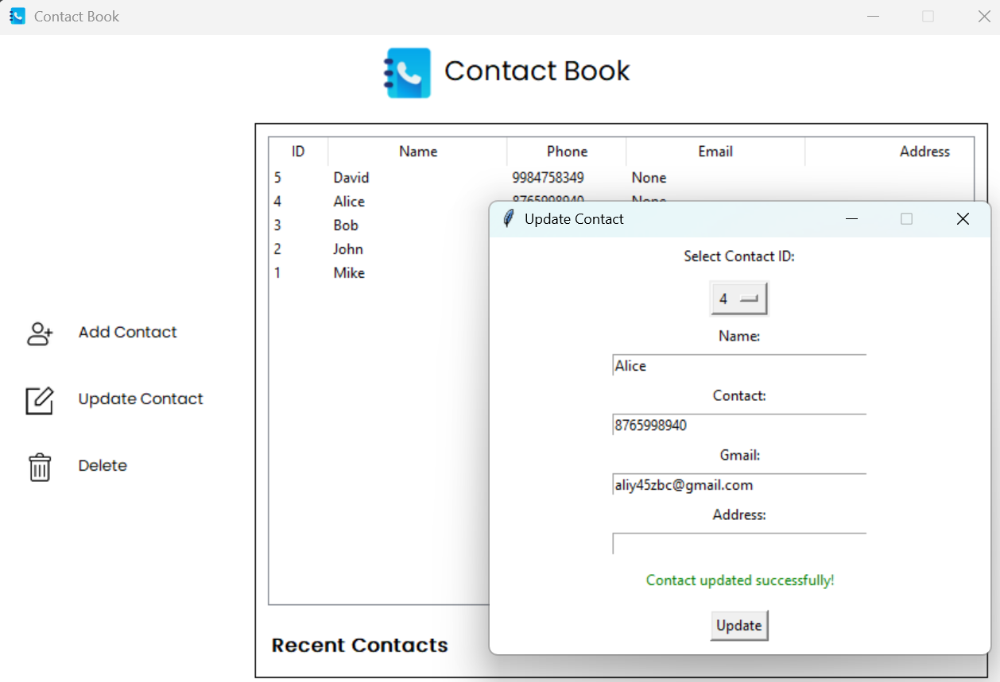
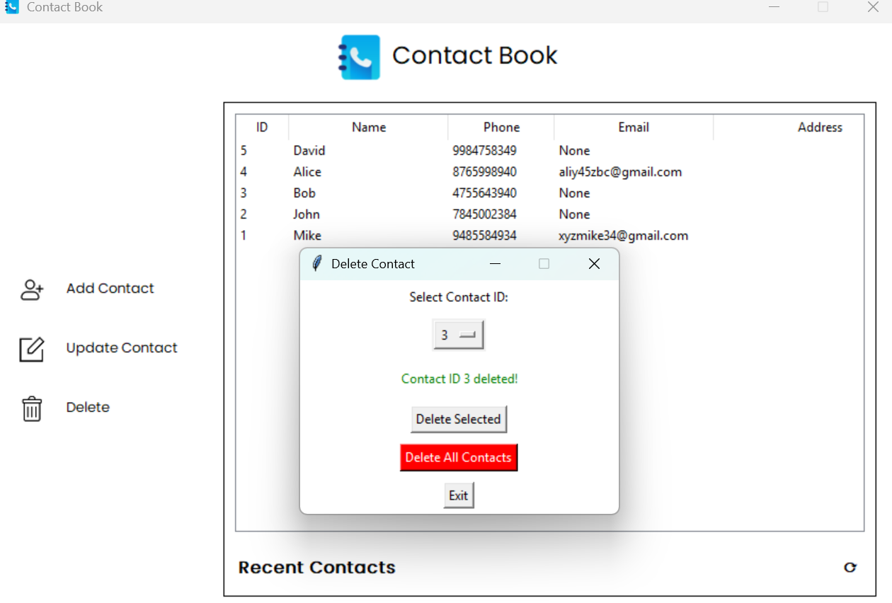
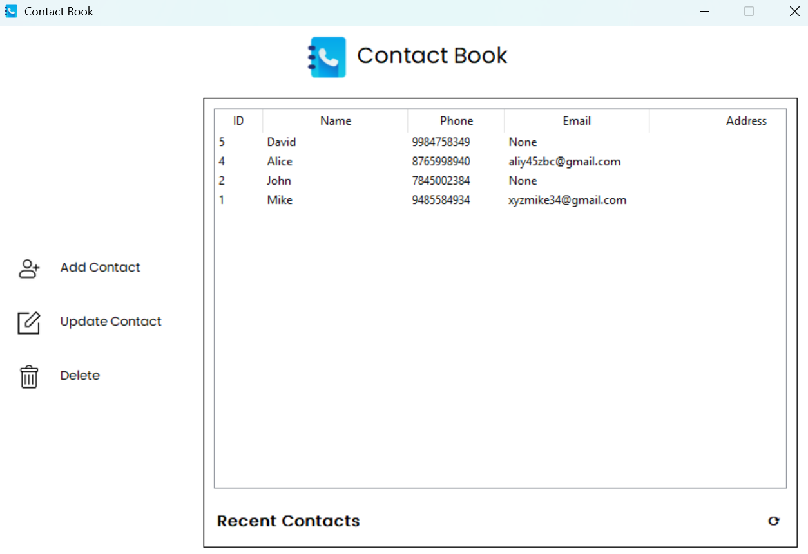

# 📒 Contact Book (Python GUI Project)

A simple **GUI-based Contact Management System** built with **Python**, using:
- **Tkinter** for the graphical interface
- **SQLite3** for database storage
- **Regex (`re`)** for input validation

---

## 📸 Screenshots
| Add Contact                                   | Update Contact                                      |
|-----------------------------------------------|-----------------------------------------------------|
|  |  |

| Delete Contact                                      | Deleted ouput                              |
|-----------------------------------------------------|--------------------------------------------|
|  |  |


---

## ✨ Features
- **Add Contact**  
  - Enter name, phone number, Gmail, and address.  
  - Validates inputs.  
  - Prevents duplicate phone numbers or Gmail entries.

- **Update Contact**  
  - Select a contact by ID from a dropdown.  
  - Auto-fills details into the form.  
  - Edit and save changes with validation.

- **Delete Contact**  
  - Delete a single contact by selecting its ID.  
  - Option to delete all contacts.

- **View Contacts**  
  - Displays all contacts in a **Treeview table**.  
  - Shows ID, Name, Phone, Gmail, and Address.  
  - Refresh button to reload the latest data.

- **Sidebar Navigation**  
  - Buttons for Add, Update, Delete.  
  - Hover effects for better UI experience.

---

## 🛠️ Requirements
- Python 3.x
- Tkinter (comes with Python)
- SQLite3 (comes with Python)

---

## 🚀 How to Run
1. Clone or download the project.
2. Run:
   ```bash
   python main.py
   ```
3. The GUI window will open with the Contact Book interface.

---

## 📂 Database
- Database file: `contacts_data.db`
- Table: `contacts`
  - `id` (Primary Key, Auto Increment)
  - `name` (Text, Required)
  - `contact` (Text, Unique, Required)
  - `gmail` (Text, Unique, Optional)
  - `address` (Text, Optional)

---

## 🎨 GUI Functionalities
- **Main Window**: Title bar, app icon, sidebar, and contact table.
- **Sidebar**: Buttons with icons for Add, Update, Delete.
- **Right Panel**: Treeview table showing recent contacts.
- **Hover Effects**: Sidebar buttons change color on hover.
- **Dialogs**: Add/Update/Delete windows open as separate forms.

---

## 🧑‍💻 Author
Mohit <br>
Github : ByteBandit-100
---
